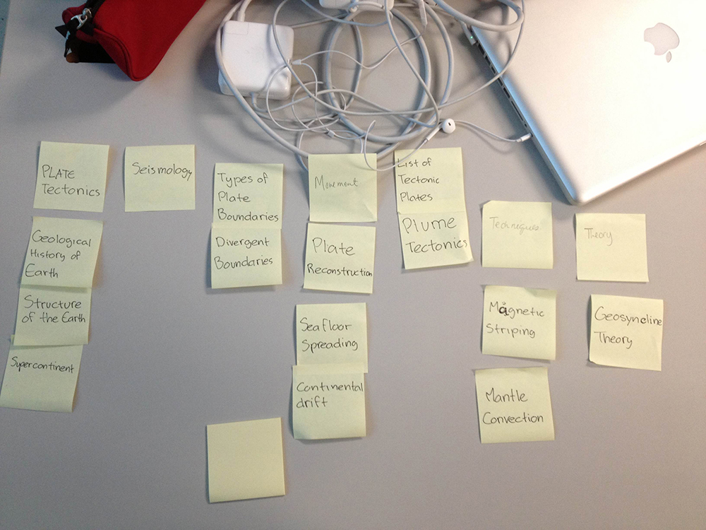

# Card sort report

The purpose of this card sort was to determine common navigation patterns and categories from the content of my Plate Tectonics large data-oriented website.

## Specifics

The card sort was conducted by Jesus G Monsalve on Tuesday 10 between the times of 8:50am and 9:20am with the following participants:

- Earaj Inam 
- Jillian Lim

### Cards

15 cards were used covering a broad range of applicable content for the website. The following topics were used as cards:

1. Plate Tectonics
2. Plume Tectonics
3. Plate Reconstruction
4. List of Tectonic Plates
5. Seismology
6. Geosyncline Theory
7. Geological history of Earth
8. Structure of the Earth
9. Supercontinent
10. Divergent Boundaries 
11. Types of Plate Boundaries
12. Seafloor Spreading
13. Continental Drift
14. Mantle Convection
15. Magnetic Striping

## Card sort results

*Card sort 1 by Earaj Inam*

*Card sort 2 by Jillian Lim*

## Observations

- The participants expressed the dificulty to comprehend the topics.
- They were not clear which theory was the main subject of the research.
- Yes they did. Some of the topics were difficult to pair or understand what they were due to not being familiar wiht the topics.
- Both card sortings were grouped differently with few similarities in with the more known topics. 
- Not really, both sorting made sense in their own logic.
- I would have to say that it was fairly well to what I was expecting due to the difficulty of understanding the topic.
- It was interesting to see how each individual grouped each topics on their own logical order.